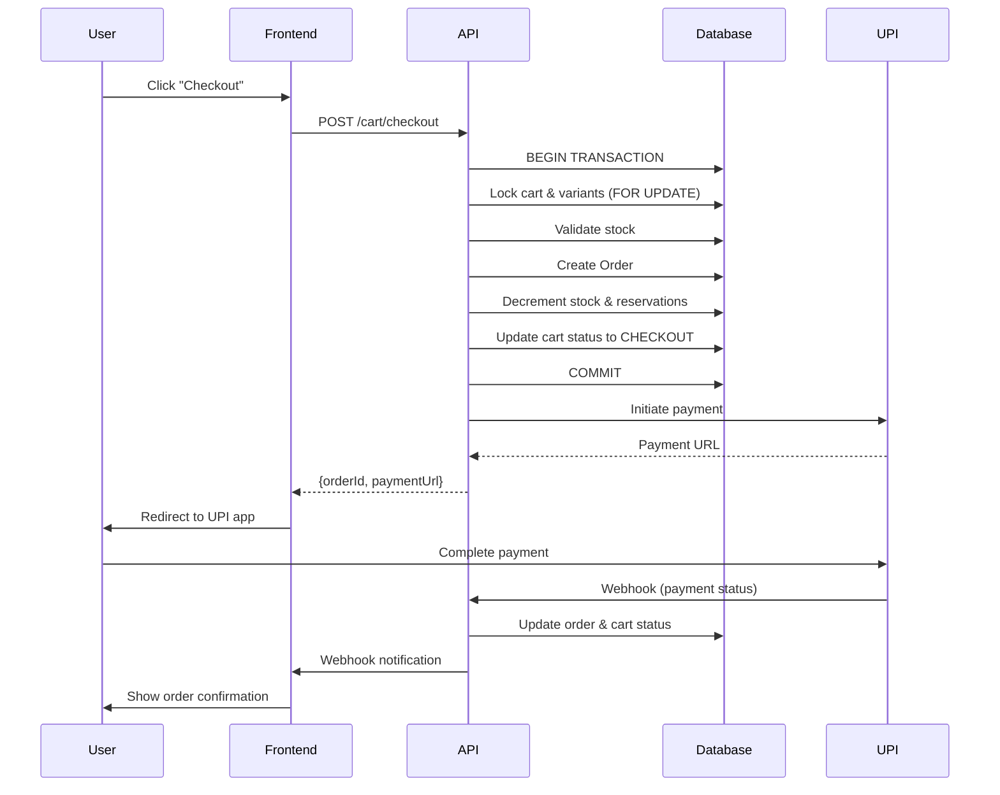

# Cart API Documentation for Frontend Developers

## Table of Contents
1. [Overview](#overview)
2. [Authentication](#authentication)
3. [Base URL](#base-url)
4. [Cart Lifecycle](#cart-lifecycle)
5. [API Endpoints](#api-endpoints)
6. [Error Handling](#error-handling)
7. [Checkout Process](#checkout-process)
8. [Sprint 2 Changes](#sprint-2-changes)

---

## Overview

The Cart API provides a complete shopping cart and checkout system with:
- Real-time stock reservation using pessimistic locking
- Redis caching for fast cart reads
- Automatic reservation cleanup
- UPI payment integration (PhonePe/GooglePay)
- Comprehensive error handling with user-friendly messages

---

## Authentication

All cart endpoints require authentication via Bearer token.

```http
Authorization: Bearer <your_access_token>
```

---

## Base URL

```
Development: http://localhost:3000/cart
Production: https://api.magicpages.com/cart
```

---

## Cart Lifecycle

### Cart Status Flow

```
ACTIVE → CHECKOUT → COMPLETED (payment success)
                  ↘ ABANDONED (payment failed/timeout)
```

**Status Descriptions:**
- `ACTIVE`: User is browsing and adding items
- `CHECKOUT`: Payment is being processed
- `COMPLETED`: Order created, payment successful
- `ABANDONED`: Payment failed or timed out

### Reservation Lifecycle

1. **Add to Cart**: Stock is reserved (for physical items)
2. **15-minute TTL**: Reservation expires if no checkout
3. **Checkout**: Reservation converted to order
4. **Completion**: Stock decremented, reservation released
5. **Abandonment**: Reservation released, stock returned

### Cart Status Flow Diagram

```
┌─────────┐
│ ACTIVE  │ ← User adds/removes items
└────┬────┘
     │ POST /cart/checkout
     ▼
┌──────────┐
│ CHECKOUT │ ← Payment processing
└────┬─────┘
     │
     ├─ Payment Success ──→ ┌───────────┐
     │                      │ COMPLETED │ → Archived to cart_history
     │                      └───────────┘
     │
     └─ Payment Failed ───→ ┌───────────┐
                            │ ABANDONED │ → Reservations released
                            └───────────┘
```

### Error Handling Mechanism

All cart operations use a centralized exception filter that:

1. **Catches all exceptions** (HTTP and unexpected)
2. **Transforms to user-friendly format** with error codes
3. **Logs with context** (user ID, path, method)
4. **Returns consistent JSON** structure

**Example Error Flow:**
```typescript
// Backend: Cart Service throws error
throw new ConflictException({
  code: 'INSUFFICIENT_STOCK',
  message: 'Insufficient stock',
  details: { available: 5, requested: 10, variantId: 123 }
});

// Exception Filter transforms it
{
  "success": false,
  "error": {
    "code": "INSUFFICIENT_STOCK",
    "message": "Sorry, we don't have enough stock for this item.",
    "details": {
      "available": 5,
      "requested": 10,
      "variantId": 123
    },
    "suggestedAction": "Please reduce the quantity or try again later."
  }
}

// Frontend receives user-friendly error
```

---

## API Endpoints

### 1. Get Cart

Retrieve the current user's cart.

**Endpoint:** `GET /cart`

**Response:**
```json
{
  "id": "uuid",
  "items": [
    {
      "id": "uuid",
      "bookFormatVariantId": 123,
      "title": "The Great Gatsby",
      "unitPrice": 299.99,
      "qty": 2,
      "image": "https://...",
      "subtotal": 599.98
    }
  ],
  "subtotal": 599.98,
  "shipping": 0,
  "discount": 0,
  "total": 599.98
}
```

**Caching:** Cached for 1 hour, invalidated on writes

---

### 2. Add Item to Cart

Add a book variant to the cart with stock reservation.

**Endpoint:** `POST /cart/items`

**Request Body:**
```json
{
  "bookFormatVariantId": 123,
  "qty": 2
}
```

**Validation:**
- `bookFormatVariantId`: Required, must be a valid variant ID
- `qty`: Required, minimum 1

**Response:** Same as Get Cart

**Errors:**
- `404`: Book variant not found
- `409`: Insufficient stock (see [Error Handling](#error-handling))

**Stock Reservation:**
- Physical books: Stock reserved immediately
- Digital books: No reservation needed

---

### 3. Update Cart Item

Change the quantity of an existing cart item.

**Endpoint:** `PUT /cart/items/:itemId`

**Request Body:**
```json
{
  "qty": 3
}
```

**Validation:**
- `qty`: Required, minimum 1

**Response:** Same as Get Cart

**Errors:**
- `404`: Cart item not found
- `403`: Unauthorized access
- `409`: Insufficient stock

**Stock Adjustment:**
- Increasing qty: Additional stock reserved
- Decreasing qty: Excess reservation released

---

### 4. Remove Item from Cart

Remove an item and release its reservation.

**Endpoint:** `DELETE /cart/items/:itemId`

**Response:** `204 No Content`

**Errors:**
- `404`: Cart item not found
- `403`: Unauthorized access

**Stock Release:** Reservation released immediately

---

### 5. Clear Cart

Remove all items and release all reservations.

**Endpoint:** `POST /cart/clear`

**Response:** `204 No Content`

---

### 6. Checkout (Coming in Sprint 2)

Initiate checkout and payment.

**Endpoint:** `POST /cart/checkout`

**Request Headers:**
```http
Idempotency-Key: <unique-request-id>
```

**Request Body:**
```json
{
  "paymentMethod": "phonepe" | "googlepay",
  "shippingAddress": {
    "line1": "123 Main St",
    "city": "Mumbai",
    "state": "Maharashtra",
    "pincode": "400001",
    "phone": "+91 9876543210"
  }
}
```

**Response:**
```json
{
  "orderId": "uuid",
  "paymentUrl": "upi://pay?...",
  "status": "PENDING_PAYMENT",
  "expiresAt": "2024-01-01T12:30:00Z"
}
```

**Process:**
1. Cart status → `CHECKOUT`
2. Order created with `PENDING_PAYMENT` status
3. Stock finalized (decremented)
4. UPI payment initiated
5. User redirected to payment URL

---

## Error Handling

### Error Response Format

All errors return a consistent JSON structure:

```json
{
  "success": false,
  "error": {
    "code": "ERROR_CODE",
    "message": "User-friendly error message",
    "details": {
      "available": 5,
      "requested": 10
    },
    "suggestedAction": "What the user should do next"
  }
}
```

### Error Codes

| Code | HTTP Status | Message | Suggested Action |
|------|-------------|---------|------------------|
| `CART_NOT_FOUND` | 404 | Your cart could not be found | Start a new cart by adding items |
| `CART_EMPTY` | 400 | Your cart is empty | Browse catalog and add items |
| `CART_ITEM_NOT_FOUND` | 404 | Item not found in cart | Refresh your cart |
| `INSUFFICIENT_STOCK` | 409 | Not enough stock available | Reduce quantity or try later |
| `PAYMENT_FAILED` | 402 | Payment could not be processed | Check payment details and retry |
| `PAYMENT_TIMEOUT` | 408 | Payment processing timed out | Try completing payment again |
| `TRANSACTION_ROLLBACK` | 500 | Transaction rolled back safely | Try your request again |
| `IDEMPOTENCY_CONFLICT` | 409 | Request already processed | Check order history |
| `INVALID_CART_STATUS` | 400 | Cart in invalid state | Start a new cart |
| `UNAUTHORIZED_ACCESS` | 403 | No permission to access cart | Log in and try again |

### Example: Insufficient Stock Error

**Request:**
```http
POST /cart/items
{
  "bookFormatVariantId": 123,
  "qty": 10
}
```

**Response:** `409 Conflict`
```json
{
  "success": false,
  "error": {
    "code": "INSUFFICIENT_STOCK",
    "message": "Sorry, we don't have enough stock for this item.",
    "details": {
      "available": 5,
      "requested": 10,
      "variantId": 123
    },
    "suggestedAction": "Please reduce the quantity or try again later."
  }
}
```

### Frontend Error Handling Example

```typescript
try {
  const response = await fetch('/cart/items', {
    method: 'POST',
    headers: {
      'Authorization': `Bearer ${token}`,
      'Content-Type': 'application/json'
    },
    body: JSON.stringify({ bookFormatVariantId: 123, qty: 10 })
  });

  if (!response.ok) {
    const error = await response.json();
    
    // Show user-friendly message
    showToast(error.error.message, 'error');
    
    // Show suggested action
    if (error.error.suggestedAction) {
      showActionButton(error.error.suggestedAction);
    }
    
    // Handle specific error codes
    switch (error.error.code) {
      case 'INSUFFICIENT_STOCK':
        // Update UI to show available stock
        updateStockDisplay(error.error.details.available);
        break;
      case 'CART_EMPTY':
        // Redirect to catalog
        router.push('/catalog');
        break;
    }
  }
} catch (err) {
  showToast('Network error. Please check your connection.', 'error');
}
```

---

## Checkout Process

### Complete Checkout Flow



### Step-by-Step Guide

#### Step 1: Validate Cart
```typescript
// Ensure cart has items
const cart = await getCart();
if (cart.items.length === 0) {
  throw new Error('Cart is empty');
}
```

#### Step 2: Collect Shipping Info
```typescript
const shippingAddress = {
  line1: "123 Main St",
  city: "Mumbai",
  state: "Maharashtra",
  pincode: "400001",
  phone: "+91 9876543210"
};
```

#### Step 3: Initiate Checkout
```typescript
const idempotencyKey = generateUUID(); // Store this!

const response = await fetch('/cart/checkout', {
  method: 'POST',
  headers: {
    'Authorization': `Bearer ${token}`,
    'Idempotency-Key': idempotencyKey,
    'Content-Type': 'application/json'
  },
  body: JSON.stringify({
    paymentMethod: 'phonepe',
    shippingAddress
  })
});

const { orderId, paymentUrl, expiresAt } = await response.json();

// Store orderId for tracking
localStorage.setItem('pendingOrderId', orderId);
```

#### Step 4: Redirect to Payment
```typescript
// For mobile apps
window.location.href = paymentUrl; // Opens UPI app

// For web
window.open(paymentUrl, '_blank');
```

#### Step 5: Handle Payment Callback
```typescript
// Listen for webhook or poll order status
const checkPaymentStatus = async (orderId) => {
  const response = await fetch(`/orders/${orderId}`);
  const order = await response.json();
  
  if (order.paymentStatus === 'PAID') {
    // Show success
    router.push(`/orders/${orderId}/confirmation`);
  } else if (order.paymentStatus === 'FAILED') {
    // Show failure, cart status is ABANDONED
    showError('Payment failed. Your cart items are still reserved.');
  }
};

// Poll every 2 seconds for 5 minutes
const pollInterval = setInterval(() => {
  checkPaymentStatus(orderId);
}, 2000);

setTimeout(() => clearInterval(pollInterval), 300000);
```

---

## Sprint 2 Changes

### What's New

#### 1. Cart Status Enum
**Before:** String status (`'ACTIVE'`)
**After:** Enum with 4 states

```typescript
enum CartStatus {
  ACTIVE = 'ACTIVE',
  CHECKOUT = 'CHECKOUT',
  COMPLETED = 'COMPLETED',
  ABANDONED = 'ABANDONED'
}
```

**Impact:** Frontend should handle all 4 states

#### 2. Optimized Reservation Worker
**Before:** Polled all active carts every 5 minutes
**After:** Event-driven, only processes completed/abandoned carts

**Impact:** No frontend changes needed, but improved performance

#### 3. Cart History
**New Feature:** Completed/abandoned carts archived to `cart_history`

**Impact:** Users can view past carts via new endpoint (coming soon)

#### 4. Enhanced Error Handling
**Before:** Generic error messages
**After:** Structured errors with codes and suggestions

**Impact:** Frontend should use new error format (see [Error Handling](#error-handling))

### Migration Guide

#### Update Error Handling
```typescript
// OLD
if (!response.ok) {
  const error = await response.json();
  alert(error.message); // Generic
}

// NEW
if (!response.ok) {
  const error = await response.json();
  showToast(error.error.message, 'error'); // User-friendly
  
  if (error.error.suggestedAction) {
    showActionButton(error.error.suggestedAction);
  }
}
```

#### Handle Cart Status
```typescript
// Check cart status before operations
const cart = await getCart();

if (cart.status === 'CHECKOUT') {
  // Show "Payment in progress" message
  showMessage('Your payment is being processed...');
} else if (cart.status === 'COMPLETED') {
  // Cart is archived, create new one
  // This happens automatically on next add-to-cart
} else if (cart.status === 'ABANDONED') {
  // Payment failed, items still in cart
  showMessage('Your previous payment failed. Items are still reserved.');
}
```

---

## Best Practices

### 1. Idempotency
Always use idempotency keys for checkout:
```typescript
const idempotencyKey = `checkout-${userId}-${Date.now()}`;
```

### 2. Error Display
Show both message and suggested action:
```typescript
<Alert severity="error">
  <AlertTitle>{error.message}</AlertTitle>
  {error.suggestedAction}
</Alert>
```

### 3. Stock Display
Update available stock on insufficient stock error:
```typescript
if (error.code === 'INSUFFICIENT_STOCK') {
  setMaxQuantity(error.details.available);
  showMessage(`Only ${error.details.available} items available`);
}
```

### 4. Loading States
Show loading during stock reservation:
```typescript
const [isAddingToCart, setIsAddingToCart] = useState(false);

const addToCart = async () => {
  setIsAddingToCart(true);
  try {
    await api.post('/cart/items', { ... });
  } finally {
    setIsAddingToCart(false);
  }
};
```

### 5. Optimistic Updates
Update UI optimistically, rollback on error:
```typescript
const optimisticCart = [...cart.items, newItem];
setCart(optimisticCart);

try {
  await api.post('/cart/items', newItem);
} catch (error) {
  setCart(cart); // Rollback
  showError(error.message);
}
```

---

## Testing

### Test Scenarios

1. **Insufficient Stock**
   - Add 100 items when only 5 available
   - Verify error code and available stock in response

2. **Concurrent Requests**
   - Two users add last item simultaneously
   - One should succeed, one should get insufficient stock

3. **Payment Timeout**
   - Initiate checkout, don't complete payment
   - After 15 minutes, cart should be abandoned

4. **Idempotency**
   - Submit checkout twice with same idempotency key
   - Second request should return existing order

---

## Support

For questions or issues:
- Email: dev@magicpages.com
- Slack: #cart-api
- Docs: https://docs.magicpages.com/cart-api
